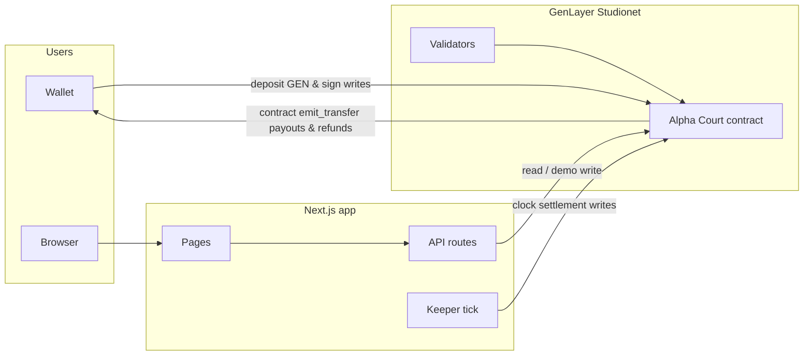
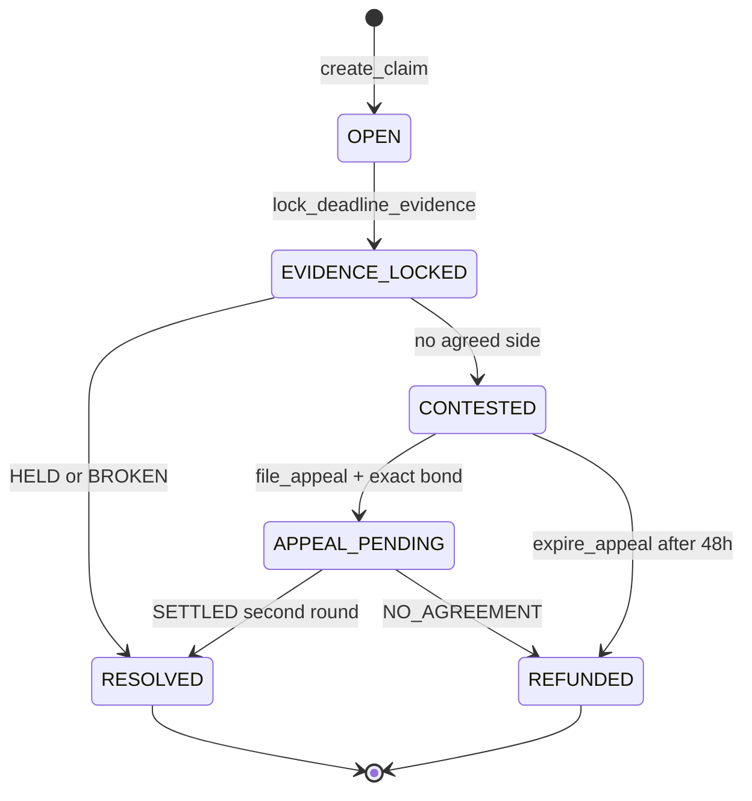
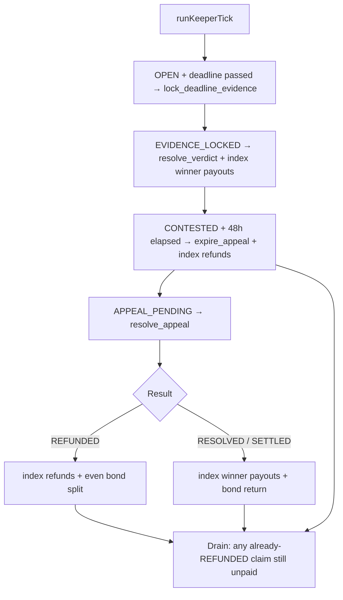

#  Alpha Court

**On-chain prediction court on GenLayer.** Post a claim, stake GEN for or against it, lock Surf evidence at the deadline, and settle with validator consensus.

[](./LICENSE)
[](https://nextjs.org)
[](https://www.genlayer.com)
[](https://vercel.com)

**Live demo:** [alpha-court.vercel.app](https://alpha-court.vercel.app)

Live Studionet court (chain `61999`): [`0x3112e93170706119e9e9Bdc552cde57cf596A10b`](https://studio.genlayer.com)

*Deployment note:* The live Studionet address above is the currently deployed court with full declared-time from/to lock sampling (payload timestamp $\le$ declared deadline verified), canonical UTC deadline normalization, 0-winner refunds, 0-staker NO_AGREEMENT bond return, custody escape hatches (`expire_unsettled`, `expire_unresolved_lock`, `expire_unresolved_appeal`, `retry_refund`), and native contract `emit_transfer` payouts live and proven on-chain.

Deposit address is the court itself (`treasury = SELF`). Users send GEN here; the contract verifies the transfer by hash and pays winners from that same balance.

Alpha Court is a prediction-market court. A claim is a timed, staked question about the world. Validators freeze public evidence at the deadline and try to agree **HELD** or **BROKEN**. If they cannot agree, the claim is **CONTESTED**: a 48-hour appeal window, then a second consensus round or a refund.

---

## At a glance

- **The loop:** post a claim → others stake GEN for or against it → at the deadline, evidence gets frozen → GenLayer validators reach consensus on HELD or BROKEN (or the claim is CONTESTED and goes to appeal) → winners get paid.
- **Three claim types today:** a price crossing a threshold, one asset outperforming another, or an on-chain/DeFi metric crossing a threshold.
- **Lock samples Surf historically.** `lock_deadline_evidence` queries `/market/price` with documented `from`/`to` (1-day lookback) and freezes the last payload point at or before the claim deadline (enforced across both series arrays and single-object payloads; single object after deadline raises `[EXTERNAL]`). `deadline_fetched_at` always records the selected payload point's canonical UTC time, never falling back to the request deadline. Deadlines are canonical UTC (`YYYY-MM-DDTHH:MM:SSZ`). If the winning side has no stakers, deposited stakes are refunded. If a NO_AGREEMENT appeal has zero original stakers, the 1 GEN floor bond returns to the filer. Complete custody protections ensure GEN cannot sit stranded: deterministic lock failures transition to REFUNDED, unsettled claims can be expired after 24h grace (`expire_unsettled`), unresolved locked claims expire after 24h (`expire_unresolved_lock`), unresolved appeals expire after 48h (`expire_unresolved_appeal`), and `retry_refund` provides a permissioned retry path. 128 direct tests cover all 10 terminal branches with exact 0 court-balance delta.
- **Payouts on Studionet are contract-initiated.** `resolve_verdict` calls `_pay_native`, which `emit_transfer`s to the winner. Real live proof: claim #2 on `0x3112e931…`, lock `0xcf9c4de…` (stored `deadline_snapshot_at == 2026-08-29T04:00:00Z` $\le$ declared `2026-08-29T04:35:57Z`), resolve `0x926c5fc…`, child `0x69092e8…` credited 2 GEN to wallet B (38 → 40 GEN). No keeper send in that payout. The keeper still exists to *call* lock/resolve/expire on a clock.

Jump to: [How money moves on Studionet](#how-money-moves-on-studionet) · [What Alpha Court is](#what-alpha-court-is) · [Architecture](#architecture) · [Local development](#local-development) · [Honesty and known limits](#honesty-and-known-limits) · [Roadmap](#roadmap--not-yet-built)

---

## How money moves on Studionet

Users send GEN to the court address. The contract re-fetches that transfer (`eth_getTransactionByHash` + `strict_eq` on `{from,to,value,status}`) and records the stake. At resolve, `_pay_native` reconstructs the recipient from a storage `Address` via `Address(hex)` — the shape proven in settle_probe Run C (`0x758CA957…` / `0xaa9b35c3…` / recipient delta exactly `7000000000000000` atto) — and `emit_transfer`s from the contract's own balance. Passing a calldata-typed `Address` straight into that interface is what used to raise `SystemError: 2 inval`; that was a type-handling bug, not a Studionet platform limit.

| Layer | What it does |
|---|---|
| Intelligent contract | Decides who won, holds the verified deposits, and pays winners/refunds via `emit_transfer`. |
| Keeper (Next.js) | Calls `lock_deadline_evidence` / `resolve_verdict` / `expire_appeal` / `resolve_appeal` on a clock. It does **not** send the payout GEN. |

**This is Studionet-specific.** Testnet Asimov / Bradbury (chain `4221`) still sit on the GenLayer Chain ghost-contract path the official docs describe; IC→EOA there is a real, open limitation. If this project ever leaves Studionet, `_pay_native` has to be re-proven on that network. The pinned runner `py-genlayer:1jb45aa8ynh2a9c9xn3b7qqh8sm5q93hwfp7jqmwsfhh8jpz09h6` is the one this Studionet instance accepts; genvm-lint reports a newer upstream runner. The current official faucet failed to even deploy here.

**Retired courts (do not settle on any — legacy docket, read-only):**

| Address | Retired because |
|---|---|
| `0xd3cD69C30A4e899bA2D346723bffac066543cF97` | Superseded by the second deployment below. Historical unpaid winners are a known leftover from an earlier pass; only claim 31 was made whole there. |
| `0x8b2fF616d26Cb9bE48f4484BD5F8E7Cdaeca7902` | Source and deployed bytecode drifted apart: the deterministic outcome cross-check (`_naive_outcome`, closing a FairSplit-shaped consensus gap) was added to `alpha_court.py` after this deployment, so its live bytecode never had the fix. Its 22 settled claims are preserved through the legacy-docket merge. |
| `0x22Cf7A9eA315e6EcE6C2BCBF60F0f656C39CCEE4` | Real steward review found two more gaps this deployment's bytecode never had the fix for: the keeper's payout decision read the Redis stake cache instead of contract state, and `stake_for`/`stake_against`/`file_appeal` enforced deadlines only via `claim.state`, not an independent timestamp check. Both fixed in `alpha_court.py` (`get_stakers_for_claim` + direct `gl.message_raw["datetime"]` checks) — see "Payout authority and deadline enforcement" below. |
| `0xF9Df5e7b7E2119FC8186f7f21Dd37E075a4aCe85` | Custodial payable stakes, retired when the design moved to tx-hash deposits while `_pay_native` was still a no-op. |
| `0x219e753176D1157bC22376e10d06e4E21E401417` | Tx-hash deposits to a shared EOA treasury; payouts still keeper-sent. Retired when `_pay_native` was un-stubbed and treasury rotated to the contract (`SELF`) so spent hashes cannot replay. |
| `0x1b8Fc1a2B16352228f2016DB1BBbeAaBA9192B37` | Contract-held payout worked, but `retry_payout` was permissionless with no `paid` flag, so a `RESOLVED` claim could be paid again from pooled deposits. |
| `0x0312c04cA7a5D29025f01d9487e62Fb4fe182C04` | Self-treasury and emit_transfer proven, but lacked historical from/to evidence sampling, payload timestamp verification, and custody expiry escape hatches. |

Contracts can't be upgraded in place, so each fix above meant a fresh deployment rather than a patch. Claim ids restart from 1 on every new deployment, so every store that looks claims up by id is keyed by `origin_contract::claim_id`, never a bare id — see `web/lib/legacy-claim-ids.ts`.

---

## What Alpha Court is

### Claim types

| Type | Question shape |
|---|---|
| **Price threshold** | Asset vs a number (`ETH/USD above 3000`) |
| **Relative performance** | Asset A vs asset B over the window |
| **Fundamentals** | A named metric vs a threshold (e.g. BTC MVRV) |

### Lifecycle in plain language

1. Someone **posts** a claim. Posting-time evidence is fetched inline. The claim stays **OPEN** for staking until the deadline.
2. Others **stake 1–10 GEN** FOR or AGAINST.
3. After the deadline, anyone (in practice the keeper) calls `lock_deadline_evidence`. Surf historical `from`/`to` is queried; the last point at or before the declared deadline is frozen. Staking closes. State is **EVIDENCE_LOCKED**.
4. `resolve_verdict` runs a leader verdict + validator check on the locked snapshots.
   - Decisive **HELD** or **BROKEN** → **RESOLVED**. Passport records a win/loss. Contract pays winners via `emit_transfer`. If the winning side has no stakers, every deposited stake is refunded.
   - No single side → **CONTESTED**. Stakes stay locked.
5. **CONTESTED** has a **48-hour** window from `contested_at`.
   - File an appeal with **exactly** the stored bond (25% of the pool, clamped 1–5 GEN) → **APPEAL_PENDING**.
   - No appeal → `expire_appeal` → **REFUNDED**. Contract refunds original stakes via `emit_transfer`.
6. **APPEAL_PENDING** is a second consensus round on the same locked snapshots (never re-fetched).
   - Decisive verdict → **SETTLED** / **RESOLVED**. Bond returns to the filer. Contract pays winners + returns bond via `emit_transfer`.
   - Still no agreement → **NO_AGREEMENT** / **REFUNDED**. Bond is forfeited and split evenly across original staker addresses. If nobody staked, the bond returns to the filer instead of sitting in the contract. Contract refunds stakes + bond shares via `emit_transfer`.
   - One dispute cycle. No third round.

---

## Architecture



### State machine



### Keeper cycle (every tick)



On a long-lived Node process (`next dev` / `next start`), the keeper also runs `setInterval` (default 60s). **Production ticks are not Vercel Cron.** Hobby serverless functions time out at 10 seconds; a Studio consensus write takes longer. Production cadence is a GitHub Actions job (`.github/workflows/keeper.yml`) that runs `npm run keeper` on a Linux runner about **once a minute** (GitHub may delay under load). That process uses the same contract, the same keeper key, and the same Redis book as the Next.js app.

---

## How money moves

| Path | Contract | Keeper |
|---|---|---|
| Winners | `_payout_for_claim` then `_pay_native` `emit_transfer` | Calls `resolve_verdict`; does not send GEN |
| Stake refund | `_refund_all_stakes` then `_pay_native` | Calls `expire_appeal` / `resolve_appeal`; does not send GEN |
| Bond SETTLED | `_return_appeal_bond` then `_pay_native` | Same |
| Bond NO_AGREEMENT | `_distribute_bond_evenly` then `_pay_native` | Same |

**Dust / remainder.** Naive `stake + (stake × losing) // winning` can leave up to `winning_pool − 1` atto in the contract. `_allocate_losing_shares` assigns leftover atto to the **last recipient after sorting by lowercase address hex, ascending**. The even bond split uses the same rule (`bond % n` to the highest address). The leftover always goes somewhere real and is stable across runs.

**UI.** My Stakes marks **Paid** or **Returned** only after `getBalance` actually increased. An indexed IC child is not enough.

**Idempotency.** Keeper skips an address that already has a payout/refund row for that claim and origin.

---

## Payout authority and deadline enforcement

The currently exported `creditResolvedWinners` / `creditRefundedStakers` are observation-only (`return []`); the contract pays via `emit_transfer`.

Real steward review, two findings, both fixed:

**1. The keeper's payout decision now comes from the contract, never the cache.** `creditResolvedWinners`/`creditRefundedStakers` used to build the winner/staker list from the Redis stake cache (`lib/genlayer/stakes.ts`) — a store built for UI display speed and rate-limit mitigation, mutable and unauthenticated. A wrong or missing row there had a real path to a wrong payout. `alpha_court.py` gained a new view, `get_stakers_for_claim`, that enumerates every real staker + side + amount straight from contract storage (`get_stake` alone wasn't enough — it requires already knowing which address to ask about, and the cache was the only prior source of that list). The keeper now calls this on every credit, and the cache is never consulted for the payout decision at all.

Proven adversarially, for real, not just claimed: a real claim on the live court, real stakes, then two corrupted local-cache states before calling the real `creditResolvedWinners`:
  - A fabricated cache row claiming 999 GEN staked (the real stake was 2 GEN) — the real payout sent was exactly 3 GEN (2 GEN stake + 1 GEN losing-pool share), and real `getBalance` confirmed it: 30.0 → 33.0 GEN. The fabricated row had zero effect.
  - A cache row that never existed at all for a real staker (simulating deletion) — the keeper still correctly identified them via `get_stakers_for_claim` and paid their real 3 GEN stake in full: real balance 3.0 → 6.0 GEN.

**2. Staking and appeal deadlines are now enforced inside the contract, not just via state.** `claim.state` only changes when someone actually calls `lock_deadline_evidence` / `expire_appeal` — permissionless, but not automatic. That left a real window where the real deadline (or the real 48-hour appeal window) had already passed but state hadn't moved yet, in which a late stake or a late appeal could otherwise succeed. `_stake` now checks `gl.message_raw["datetime"] >= claim.deadline` directly; `file_appeal` now checks `_appeal_window_elapsed(claim.contested_at, ...)` directly — both independent of state, both proven with real reverts in `contract/test/direct/test_deadline_enforcement.py` (state deliberately left unmoved, deadline backdated via direct storage reach-in, confirms the timestamp check alone stops it).

---

## Keeper cycle in detail

**Production evidence:** GitHub Actions workflow `Keeper tick`, scheduled `* * * * *`. Manual run: Actions → Keeper tick → Run workflow.

Every tick, when `KEEPER_ENABLED=true` and Studio is not in cooldown (max one of each write per tick):

1. **Lock** — `OPEN` + deadline passed → `lock_deadline_evidence`
2. **Resolve** — `EVIDENCE_LOCKED` → `resolve_verdict`, then native payouts
3. **Expire** — `CONTESTED` + 48h → `expire_appeal`, then native refunds
4. **Appeal** — `APPEAL_PENDING` → `resolve_appeal`, then payouts or refunds
5. **Drain** — any claim **already** in `REFUNDED` whose stakes/bond have not been native-sent (human `expire_appeal` / `resolve_appeal`, or a failed prior credit)

Human fallbacks remain permissionless on-chain. The drain pass is what stops refunds from sitting unpaid if a person, not the keeper, flipped the state.

---

## Appeals

- Window is **48 hours** from `contested_at` (does not move).
- Bond is computed once at CONTESTED: 25% of the FOR+AGAINST pool, clamped **1–5 GEN**. Filing requires **exactly** that amount.
- Round 2 reuses `_resolve_verdict_with_consensus` on the **same locked snapshots**.
- Independent proofs in `contract/test/direct/test_consensus_gap.py`:
  - `test_resolve_appeal_cannot_store_held_when_second_text_parses_broken`
  - `test_resolve_appeal_conflicting_words_are_no_agreement_not_a_side`

---

## Tech stack

| Layer | Stack |
|---|---|
| App | Next.js 16 App Router, React 19, TypeScript, Tailwind |
| Book | Upstash Redis (REST hashes). Local fallback: `.data/` JSON, never on Vercel. |
| Chain | GenLayer Intelligent Contract (Python), Studionet |
| Wallet | `genlayer-js` + browser wallet (MetaMask) |
| Evidence | Surf API (display + contract consensus fetches) |
| Tests | `pytest` + `genlayer-test` (direct mode), Node `tsx --test` for the keeper cycle |
| Verify | Playwright walkthroughs (local; dumps are gitignored) |

```
alpha-court/
  contract/     Intelligent contract, direct + integration tests
  web/          Next.js app (Vercel root directory)
  docs/         Design tokens
  SUBMISSION.md Steward notes
```

---

## Local development

### Prerequisites

- Node 20+
- Python 3.12+
- A funded Studionet account if you want keeper writes or demo writes

### App

```bash
cd web
npm install
cp .env.example .env.local   # fill secrets locally; never commit them
npm run dev
```

Open [http://localhost:3000](http://localhost:3000).

### Contract tests

```bash
cd contract
pip install -r requirements.txt
pytest test/direct/ -v
```

### Keeper (local long-lived process)

In `.env.local`:

```
KEEPER_ENABLED=true
KEEPER_MIN_CLAIM_ID=1
KEEPER_INTERVAL_MS=60000
```

Restart `next dev`. Status: `GET /api/keeper/tick`. Manual pass: `POST /api/keeper/tick` with `Authorization: Bearer $KEEPER_SECRET` if that secret is set, or `npm run keeper` (same code GitHub Actions runs).

### Keeper cycle unit tests

```bash
cd web
npm test
```

---

## Environment variables

Copy `web/.env.example`. **Do not put real keys in git or in this README.**

| Name | Where | Purpose |
|---|---|
| `ALPHA_COURT_CONTRACT_ADDRESS` | server | Contract for reads and keeper writes. **Required at build.** |
| `NEXT_PUBLIC_ALPHA_COURT_CONTRACT_ADDRESS` | client | Same address for wallet-signed writes. **Required at build.** |
| `NEXT_PUBLIC_TREASURY_ADDRESS` | client | Court itself (treasury SELF) for stake/bond transfers. Not an EOA. Not a secret. |
| `NEXT_PUBLIC_GENLAYER_NETWORK` | client | `studionet` (default), `localnet`, `testnetAsimov`, `testnetBradbury` |
| `ALPHA_COURT_SIGNER_PRIVATE_KEY` | server | Funded Studionet account for keeper writes (lock/resolve/expire) and optional demo signing. Does not send payout GEN. |
| `ALPHA_COURT_SIGNER_ADDRESS` | server | Optional public keeper address |
| `SURF_API_KEY` | server | Display-only price/metric reads |
| `ALLOW_DEMO_SIGNING` | server | Must be `true` for unsigned server writes |
| `NEXT_PUBLIC_ALLOW_DEMO_SIGNING` | client | Whether the UI offers demo signing |
| `KEEPER_ENABLED` | server | Run settlement ticks |
| `NEXT_PUBLIC_KEEPER_ENABLED` | client | UI hint only |
| `KEEPER_MIN_CLAIM_ID` | server | Skip older test dockets |
| `KEEPER_INTERVAL_MS` | server | Local `setInterval` period (ignored on Vercel) |
| `KEEPER_SECRET` | server | Bearer token for `/api/keeper/tick` |
| `CRON_SECRET` | server | Optional Bearer for `/api/keeper/tick` |
| `UPSTASH_REDIS_REST_URL` | server | Redis REST endpoint. **Required on Vercel.** |
| `UPSTASH_REDIS_REST_TOKEN` | server | Redis REST token. **Required on Vercel.** |

On Vercel, set **Root Directory** to `web`. The app **never writes `.data/`** there (read-only FS except `/tmp`). Claims book, stake positions, payouts, and passport cache live in Redis hashes (`ac:claims`, `ac:stakes`, `ac:payouts`, `ac:passports`) so a stake on one serverless instance is visible on the next.

**Keeper cadence in production is GitHub Actions (~1 minute), not Vercel Cron.** Hobby functions cannot wait for Studio consensus.

**A real production incident, not a hypothetical.** The Redis instance originally used here was an anonymous Upstash `start-redis` demo database (`POST https://upstash.com/start-redis` — a zero-signup, agent-provisioning endpoint that expires 72 hours after creation unless claimed). It expired, silently: `hashLoad` swallowed the failure into an empty `{}`, `GET /api/claims` reported a fake `"cached":true` 200 over a dead store, and the GitHub Actions keeper relay's `|| true` loop kept reporting green for a full 12-minute run (`errors:[]` on every tick) while every real Redis operation failed underneath it. The current database is a real, named Upstash instance (`upstash-kv-gray-flame`) provisioned through the [Vercel Marketplace integration](https://vercel.com/docs/marketplace-storage) (`vercel install upstash`), tied to this project's Vercel account rather than an anonymous demo endpoint — it does not carry the same expiry. `UPSTASH_REDIS_REST_URL`/`UPSTASH_REDIS_REST_TOKEN` are set directly (not relying on a fallback to the Marketplace-injected `KV_REST_API_URL`/`KV_REST_API_TOKEN` pair, though those point at the same database and still work as a fallback if the former are ever unset). The silent-failure class itself is also fixed, not just the instance: `hashLoad` logs the real error and exposes it via `getLastRedisError()`, `GET /api/claims` returns a real `503 degraded:true` instead of a fake empty `200` when the book is unreachable, and the keeper's relay loop escalates to a real failed Action after ~75s of persistent unreachability (`scripts/run-keeper-tick.ts`'s `redisReachable()` check, distinct exit code 2, `.github/workflows/keeper.yml`'s escalation logic) instead of looping silently forever.

Pushes to `main` deploy production via [`.github/workflows/deploy.yml`](./.github/workflows/deploy.yml). GitHub Actions needs three repository secrets: `VERCEL_TOKEN` (create at [vercel.com/account/tokens](https://vercel.com/account/tokens)), `VERCEL_ORG_ID`, and `VERCEL_PROJECT_ID`. Native Vercel GitHub App linking also works if you install the [Vercel GitHub App](https://github.com/apps/vercel) on this repo and set Root Directory to `web`.

---

## Honesty and known limits

- On **Studionet**, the contract pays users. Do not describe Studionet payouts as keeper-reimbursed.
- The keeper is still required to *trigger* lock/resolve/expire. It is not required to fund payouts.
- Passing a calldata-typed `Address` into `_ExternalRecipient.emit_transfer` raises `SystemError: 2 inval`. Reconstruct via `Address(hex)` or use a storage-read Address. That bug is not "Studio cannot IC→EOA." Direct-mode tests cannot see that class of bug: the harness intercepts `EthSend` and credits balances itself.
- `retry_payout` is gated to the claim poster or the keeper and reverts `claim already paid` after a real payout. A previous court (`0x1b8Fc1a2…`) paid a `RESOLVED` claim again from pooled deposits because it had no `paid` flag.
- The IC→EOA limitation **is real on Testnet Asimov/Bradbury (chain 4221)**. If this project moves off Studionet, re-prove `_pay_native` there.
- This Studionet instance pins `py-genlayer:1jb45aa8ynh2a9c9xn3b7qqh8sm5q93hwfp7jqmwsfhh8jpz09h6`. A newer runner exists upstream; the official faucet failed to deploy here.
- Retired-court unpaid winners (claims 18–19, 21, 24–30, 32–33 on `0xd3cD69…`) were **not** all auto-repaid. Claim 31 was made whole with a keeper native send.
- There has been **no committed `REFUNDED` outcome** on either court as of the refund-path audit. The drain pass exists so a future refund cannot sit unpaid.
- **A real payout-key collision was found and fixed.** The payouts book's "already paid?" check matched on bare `claim_id` and treated a missing `originContract` as an automatic pass. Claim ids restart from 1 on every redeploy, so an old, unrelated payout row could satisfy the check for a same-numbered claim on a different court (confirmed real: a 2026-08-20 row was silently blocking claim #19's real payout on the second deployment, created three days later). Fixed in `web/lib/genlayer/payouts.ts` — the origin check now fails closed, and existing rows are backfilled with their real origin (from the transaction's own on-chain timestamp) the first time they're read.
- **`GET /api/claims/:id` was an empty HTTP 500 on production (~4.6s, empty body).** Confirmed live against `https://alpha-court.vercel.app`: `/api/keeper/tick` (no Studio read) was 200, `/cases/1` HTML rendered, and both `/api/claims/1` and `/api/claims` died with no JSON. Root cause: the route handler called Next `connection()` (an RSC primitive) and then an unbounded Studio `get_claim`; Vercel Hobby killed the invocation before the existing `catch` could write a body. The one-id handler now skips `connection()`, bounds Redis/Studio reads, and always returns JSON. `/cases/:id` had the same unbounded RSC read and flashed the global error boundary for new claims; it is bounded the same way. Staking/live poll also fall back to a browser-side Studio `get_claim`. **Remaining platform limit:** a Hobby function cannot complete `list_claims` + per-id `get_claim` against Studio. `GET /api/claims` now serves the Redis book only and always returns JSON (`claims: []` if the book is empty) instead of an empty 502. A real Redis outage returns `503` with `degraded:true`. The live docket is still on-chain; Markets can look sparse until the book is populated by one-id reads or the keeper.

---

## Project status

Adversarial passes closed:

| Pass | Result |
|---|---|
| Stuck `APPEAL_PENDING` | Keeper calls `resolve_appeal`; tests force a no-click exit |
| Refund path vs winner path | Both go through `_pay_native` `emit_transfer`; keeper only triggers the write |
| Dust / FairSplit remainder | Highest address hex receives leftover atto |
| Appeal consensus | Independent `resolve_appeal` proofs in `test_consensus_gap.py` |
| UI honesty | Paid / Returned only after balance increase |
| Residual drain + sort | Unpaid `REFUNDED` drained every tick; remainder key is sorted address |

Ready for GenLayer review.

---

## Roadmap — Not Yet Built

**Nothing in this section exists in the code today.** It's here because Alpha Court is a real product with real room to grow, not a finished demo — worth stating plainly rather than leaving unsaid. Everything above this section is the actual, current, shipped state; everything below is direction, not a promise or a committed timeline.

- **More claim types and market categories.** Today's three types (price threshold, relative performance, fundamentals) are all crypto-price-shaped. The claim/verdict machinery underneath is general — a sports result, a macro print, a real-world event, or a poll outcome fits the same OPEN → EVIDENCE_LOCKED → RESOLVED shape with a different evidence source.
- **Deeper gamification.** The app already has avatars, win/create fanfare, and a kinetic landing page. Natural next steps: staking/winning streaks, account levels, a leaderboard with real depth (categories, time windows, head-to-head records) instead of a single ranking, seasonal or themed dockets, and badges tied to real on-chain history via the Passport.
- **Richer prediction-market mechanics.** The current payout formula is a flat proportional split of the losing pool. As the product matures: dynamic pricing/odds as stakes come in, deeper liquidity mechanics, and market discovery (search, filters, trending dockets) instead of a single chronological list.
- **Removing the keeper's triggering role.** Payouts are already contract-initiated (`_pay_native`/`emit_transfer`, see "How money moves on Studionet" above) — that was never actually blocked on a platform limit, it was a type-handling bug, and it's fixed. What's still true: `lock_deadline_evidence` / `resolve_verdict` / `expire_appeal` / `resolve_appeal` are permissionless but not automatic, so *something* has to call them on a clock — today that's the GitHub Actions keeper. Removing that would mean a fully self-triggering contract (e.g. validator-initiated ticks, or a public incentive for anyone to call these on time), not a payout-authority change.
- **Broader community/governance input** on which claim categories get curated or featured, rather than a single operator's judgment call.

---

## License

MIT. See [LICENSE](./LICENSE).
