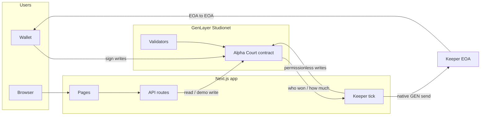
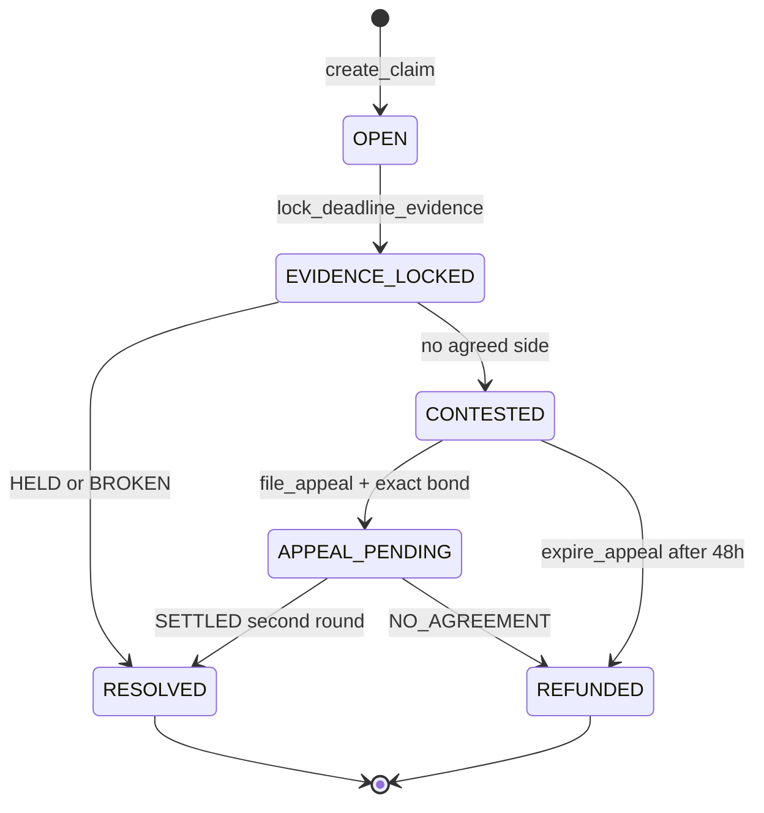
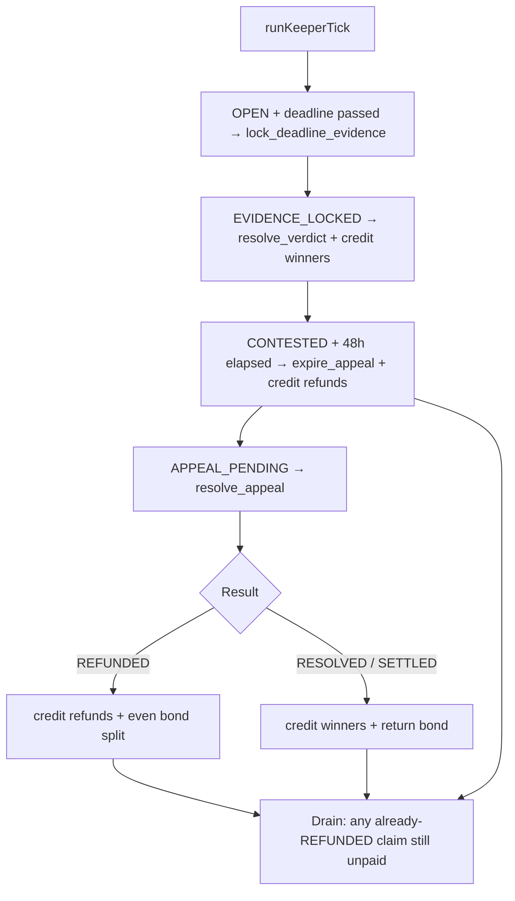

#  Alpha Court

**On-chain prediction court on GenLayer.** Post a claim, stake GEN for or against it, lock Surf evidence at the deadline, and settle with validator consensus.

[](./LICENSE)
[](https://nextjs.org)
[](https://www.genlayer.com)
[](https://vercel.com)

**Live demo:** [alpha-court.vercel.app](https://alpha-court.vercel.app)

Live Studionet court (chain `61999`): [`0x8b2fF616d26Cb9bE48f4484BD5F8E7Cdaeca7902`](https://studio.genlayer.com)

Alpha Court is a prediction-market court. A claim is a timed, staked question about the world. Validators freeze public evidence at the deadline and try to agree **HELD** or **BROKEN**. If they cannot agree, the claim is **CONTESTED**: a 48-hour appeal window, then a second consensus round or a refund.

---

## Critical platform reality

**GenLayer Studio cannot execute a contract-initiated native transfer to a plain wallet (EOA).**

| Layer | What it does | What it does not do |
|---|---|---|
| Intelligent contract | Decides *who won* and *how much is owed*. Commits `RESOLVED` / `REFUNDED`. | Pay a user. `_pay_native` is a **no-op** so a verdict is not rolled back and GEN is not orphaned into a failed child (`Contract <eoa> not found`, `value_credited: false`). |
| Keeper (Next.js) | The only thing that actually sends native GEN. | Fetch Surf or pick HELD/BROKEN. Those stay inside the contract. |

The UI says **Paid** / **Returned** only after a keeper send has **increased the wallet balance**. That split is intentional. This repo does not claim trustless or automatic *payout*.

Retired court (do not settle): `0xd3cD69C30A4e899bA2D346723bffac066543cF97`. Historical unpaid winners on that deployment are a known leftover from an earlier pass; only claim 31 was made whole there.

---

## What Alpha Court is

### Claim types

| Type | Question shape |
|---|---|
| **Price threshold** | Asset vs a number (`ETH/USD above 3000`) |
| **Relative performance** | Asset A vs asset B over the window |
| **Fundamentals** | A named metric vs a threshold (e.g. BTC MVRV) |

### Lifecycle in plain language

1. Someone **posts** a claim. Posting-time evidence is fetched inline. The claim stays **OPEN** for staking until the deadline.
2. Others **stake 1–10 GEN** FOR or AGAINST.
3. After the deadline, anyone (in practice the keeper) calls `lock_deadline_evidence`. Staking closes. State is **EVIDENCE_LOCKED**.
4. `resolve_verdict` runs a leader verdict + validator check on the locked snapshots.
   - Decisive **HELD** or **BROKEN** → **RESOLVED**. Passport records a win/loss. Keeper native-sends winners.
   - No single side → **CONTESTED**. Stakes stay locked.
5. **CONTESTED** has a **48-hour** window from `contested_at`.
   - File an appeal with **exactly** the stored bond (25% of the pool, clamped 1–5 GEN) → **APPEAL_PENDING**.
   - No appeal → `expire_appeal` → **REFUNDED**. Keeper native-sends original stakes back.
6. **APPEAL_PENDING** is a second consensus round on the same locked snapshots (never re-fetched).
   - Decisive verdict → **SETTLED** / **RESOLVED**. Bond returns to the filer. Keeper pays winners + bond.
   - Still no agreement → **NO_AGREEMENT** / **REFUNDED**. Bond is forfeited and split evenly across original staker addresses. Keeper native-sends stakes + shares.
   - One dispute cycle. No third round.

---

## Architecture



### State machine



### Keeper cycle (every tick)



On a long-lived Node process (`next dev` / `next start`), the keeper also runs `setInterval` (default 60s). **Production ticks are not Vercel Cron.** Hobby serverless functions time out at 10 seconds; a Studio consensus write takes longer. Production cadence is a GitHub Actions job (`.github/workflows/keeper.yml`) that runs `npm run keeper` on a Linux runner about **once a minute** (GitHub may delay under load). That process uses the same contract, the same keeper key, and the same Redis book as the Next.js app.

---

## How money moves

| Path | Contract | Keeper |
|---|---|---|
| Winners | `_payout_for_claim` computes `stake + losing share`, then `_pay_native` **no-op** | `creditResolvedWinners` native-sends |
| Stake refund | `_refund_all_stakes` exact original stake, `_pay_native` **no-op** | `creditRefundedStakers` native-sends |
| Bond SETTLED | `_return_appeal_bond` to filer, no-op | keeper refund-kind send to filer |
| Bond NO_AGREEMENT | `_distribute_bond_evenly` one share per unique address, no-op | keeper adds even shares after stake refunds |

**Dust / remainder.** Naive `stake + (stake × losing) // winning` can leave up to `winning_pool − 1` atto in the contract. `_allocate_losing_shares` assigns leftover atto to the **last recipient after sorting by lowercase address hex, ascending**. The even bond split uses the same rule (`bond % n` to the highest address). The leftover always goes somewhere real and is stable across runs.

**UI.** My Stakes marks **Paid** or **Returned** only after `getBalance` actually increased. An indexed IC child is not enough.

**Idempotency.** Keeper skips an address that already has a payout/refund row for that claim and origin.

---

## Keeper cycle in detail

**Production evidence:** GitHub Actions workflow `Keeper tick`, scheduled `* * * * *`. Manual run: Actions → Keeper tick → Run workflow.

Every tick, when `KEEPER_ENABLED=true` and Studio is not in cooldown (max one of each write per tick):

1. **Lock** — `OPEN` + deadline passed → `lock_deadline_evidence`
2. **Resolve** — `EVIDENCE_LOCKED` → `resolve_verdict`, then native payouts
3. **Expire** — `CONTESTED` + 48h → `expire_appeal`, then native refunds
4. **Appeal** — `APPEAL_PENDING` → `resolve_appeal`, then payouts or refunds
5. **Drain** — any claim **already** in `REFUNDED` whose stakes/bond have not been native-sent (human `expire_appeal` / `resolve_appeal`, or a failed prior credit)

Human fallbacks remain permissionless on-chain. The drain pass is what stops refunds from sitting unpaid if a person, not the keeper, flipped the state.

---

## Appeals

- Window is **48 hours** from `contested_at` (does not move).
- Bond is computed once at CONTESTED: 25% of the FOR+AGAINST pool, clamped **1–5 GEN**. Filing requires **exactly** that amount.
- Round 2 reuses `_resolve_verdict_with_consensus` on the **same locked snapshots**.
- Independent proofs in `contract/test/direct/test_consensus_gap.py`:
  - `test_resolve_appeal_cannot_store_held_when_second_text_parses_broken`
  - `test_resolve_appeal_conflicting_words_are_no_agreement_not_a_side`

---

## Tech stack

| Layer | Stack |
|---|---|
| App | Next.js 16 App Router, React 19, TypeScript, Tailwind |
| Book | Upstash Redis (REST hashes). Local fallback: `.data/` JSON, never on Vercel. |
| Chain | GenLayer Intelligent Contract (Python), Studionet |
| Wallet | `genlayer-js` + browser wallet (MetaMask) |
| Evidence | Surf API (display + contract consensus fetches) |
| Tests | `pytest` + `genlayer-test` (direct mode), Node `tsx --test` for the keeper cycle |
| Verify | Playwright walkthroughs (local; dumps are gitignored) |

```
alpha-court/
  contract/     Intelligent contract, direct + integration tests
  web/          Next.js app (Vercel root directory)
  docs/         Design tokens
  SUBMISSION.md Steward notes
```

---

## Local development

### Prerequisites

- Node 20+
- Python 3.12+
- A funded Studionet account if you want keeper sends or demo writes

### App

```bash
cd web
npm install
cp .env.example .env.local   # fill secrets locally; never commit them
npm run dev
```

Open [http://localhost:3000](http://localhost:3000).

### Contract tests

```bash
cd contract
pip install -r requirements.txt
pytest test/direct/ -v
```

### Keeper (local long-lived process)

In `.env.local`:

```
KEEPER_ENABLED=true
KEEPER_MIN_CLAIM_ID=1
KEEPER_INTERVAL_MS=60000
```

Restart `next dev`. Status: `GET /api/keeper/tick`. Manual pass: `POST /api/keeper/tick` with `Authorization: Bearer $KEEPER_SECRET` if that secret is set, or `npm run keeper` (same code GitHub Actions runs).

### Keeper cycle unit tests

```bash
cd web
npm test
```

---

## Environment variables

Copy `web/.env.example`. **Do not put real keys in git or in this README.**

| Name | Where | Purpose |
|---|---|---|
| `ALPHA_COURT_CONTRACT_ADDRESS` | server | Contract for reads and keeper writes. **Required at build.** |
| `NEXT_PUBLIC_ALPHA_COURT_CONTRACT_ADDRESS` | client | Same address for wallet-signed writes. **Required at build.** |
| `NEXT_PUBLIC_GENLAYER_NETWORK` | client | `studionet` (default), `localnet`, `testnetAsimov`, `testnetBradbury` |
| `ALPHA_COURT_SIGNER_PRIVATE_KEY` | server | Funded EOA for keeper native sends and optional demo signing |
| `ALPHA_COURT_SIGNER_ADDRESS` | server | Optional public keeper address |
| `SURF_API_KEY` | server | Display-only price/metric reads |
| `ALLOW_DEMO_SIGNING` | server | Must be `true` for unsigned server writes |
| `NEXT_PUBLIC_ALLOW_DEMO_SIGNING` | client | Whether the UI offers demo signing |
| `KEEPER_ENABLED` | server | Run settlement ticks |
| `NEXT_PUBLIC_KEEPER_ENABLED` | client | UI hint only |
| `KEEPER_MIN_CLAIM_ID` | server | Skip older test dockets |
| `KEEPER_INTERVAL_MS` | server | Local `setInterval` period (ignored on Vercel) |
| `KEEPER_SECRET` | server | Bearer token for `/api/keeper/tick` |
| `CRON_SECRET` | server | Optional Bearer for `/api/keeper/tick` |
| `UPSTASH_REDIS_REST_URL` | server | Redis REST endpoint. **Required on Vercel.** |
| `UPSTASH_REDIS_REST_TOKEN` | server | Redis REST token. **Required on Vercel.** |

On Vercel, set **Root Directory** to `web`. The app **never writes `.data/`** there (read-only FS except `/tmp`). Claims book, stake positions, payouts, and passport cache live in Redis hashes (`ac:claims`, `ac:stakes`, `ac:payouts`, `ac:passports`) so a stake on one serverless instance is visible on the next.

**Keeper cadence in production is GitHub Actions (~1 minute), not Vercel Cron.** Hobby functions cannot wait for Studio consensus.

The current Redis instance is an Upstash start-redis database. **Claim it** (or replace the env vars with your own free Upstash DB) so it does not expire: [Upstash console](https://upstash.com/start-redis/console/f4860a45-906a-4848-9cb6-766b88bd8904).

Pushes to `main` deploy production via [`.github/workflows/deploy.yml`](./.github/workflows/deploy.yml). GitHub Actions needs three repository secrets: `VERCEL_TOKEN` (create at [vercel.com/account/tokens](https://vercel.com/account/tokens)), `VERCEL_ORG_ID`, and `VERCEL_PROJECT_ID`. Native Vercel GitHub App linking also works if you install the [Vercel GitHub App](https://github.com/apps/vercel) on this repo and set Root Directory to `web`.

---

## Honesty and known limits

- The contract does **not** pay users. Do not describe payouts as trustless, guaranteed, or automatic.
- Settlement and refunds depend on a **funded keeper**. If that wallet is empty, verdicts still commit and GEN stays in the contract until a native send succeeds.
- Studio IC→EOA `emit_transfer` children fail (`Contract <eoa> not found`). That is why `_pay_native` is a no-op.
- Retired-court unpaid winners (claims 18–19, 21, 24–30, 32–33 on `0xd3cD69…`) were **not** all auto-repaid. Claim 31 was made whole with a keeper native send.
- There has been **no committed `REFUNDED` outcome** on either court as of the refund-path audit. The drain pass exists so a future refund cannot sit unpaid.

---

## Project status

Adversarial passes closed:

| Pass | Result |
|---|---|
| Stuck `APPEAL_PENDING` | Keeper calls `resolve_appeal`; tests force a no-click exit |
| Refund path vs winner path | Same no-op + keeper native send; drain for human-triggered `REFUNDED` |
| Dust / FairSplit remainder | Highest address hex receives leftover atto |
| Appeal consensus | Independent `resolve_appeal` proofs in `test_consensus_gap.py` |
| UI honesty | Paid / Returned only after balance increase |
| Residual drain + sort | Unpaid `REFUNDED` drained every tick; remainder key is sorted address |

Ready for GenLayer review.

---

## License

MIT. See [LICENSE](./LICENSE).
